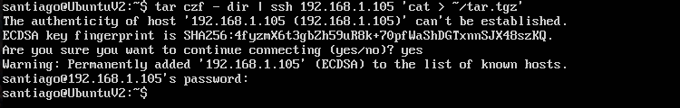
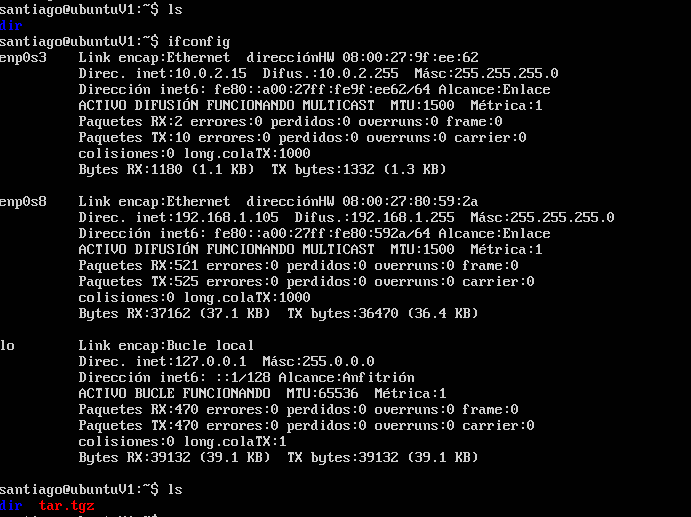
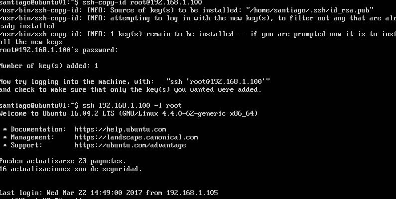
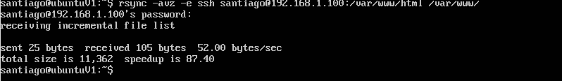
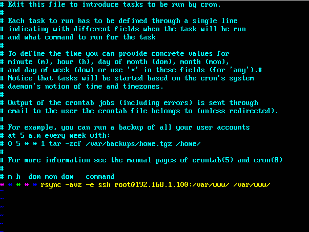
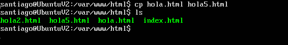
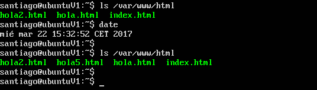

** Practica 2: Clonar la informacion de un sitio web **
=======================================================

máquinas arrancadas y configuradas de la práctica 1, creamos el fichero tar.gz con la orden

El siguiente paso consiste en instalar rsync que ya lo tenemos instalado y probar su funcionamiento.

Creamos la clave pública y la copiamos en la máquina servidor y comprobamos su funcionamiento.

*En éste paso he tenido problemas con la clave, con lo que he tenido que crearla con rsa.

Para automatizar el proceso creamos el crontab para lo que hemos usado la orden crontab -e (la indicada en el guion no me ha funcionado).

Como se muestra en la imagen lo configuramos para que se realice una copia cada minuto.

Y comprobamos el funcionamiento.

