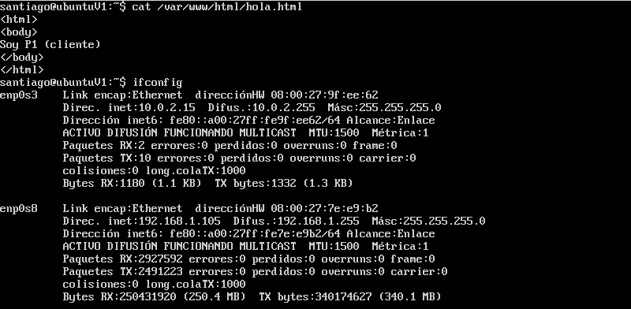
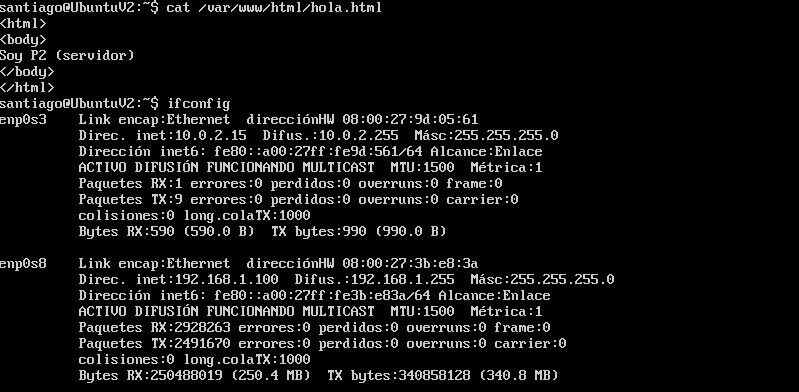
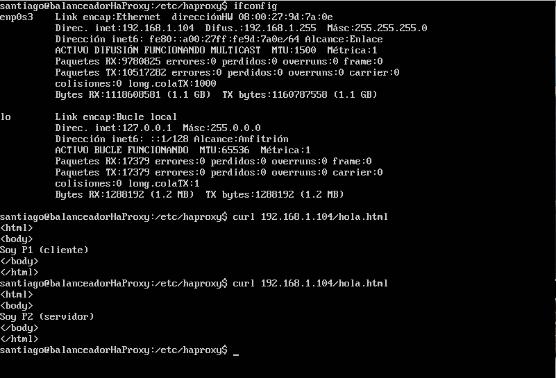
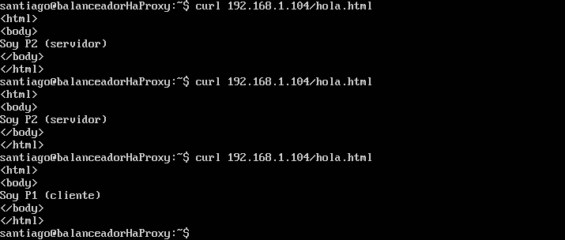

** Practica 3: Balanceador de Carga Nginx, HaProxy **
=======================================================

Empezamos con las máquinas arrancadas y configuradas de la práctica 2.
Desactivamos el crontab de la máquina cliente para que no vuelva a copiar la carpeta y modificamos, para poder diferenciarlos, los archivos de cada una de las maquinas "/var/www/html/hola.html" ésta es la carpeta que se clonaba de un servidor a otro en la práctica anterior.

Instalamos y configuramos Nginx según seguimos los pasos del guión de la práctica.
Creamos el fichero "etc/nginx/conf.d/default.conf" y le introducimos los datos del guión, modificando las ips de los sevidores, en nuestro caso 192.168.1.100 y 192.168.1.105.
No hemos tenido problemas con la configuración excepto en fallos en el fichero de configuración

El siguiente paso es comprobar el funcionamiento cambiando los pesos de los servidores, ya que por defecto usa un algoritmo round - robin, ponemos al servidor 2 weight=2 y al 1 weight=1 

Ahora instalamos y configuramos el servidor con HaProxy siguiendo los pasos de la práctica.
En el fichero de configuración una vez introducidos los datos que vienen en el guión, hemos tenido que cambiar los parametros:

contimeout 4000
clitimeout 42000
srvtimeout 43000

por 

timeout connect 4000
timeout client 	42000
timeout server 	43000

Comprobamos su funcionamiento

Y comprobamos el funcionamiento cambiando los pesos de los servidores, ponemos los mismos pesos que en Nginx

Por último usamos una máquina virtual Ubuntu de cliente para conectarnos al balanceador y realizar el benchmark con ab

Para Nginx
==========

santiago@santiago-VirtualBox:~$ ab -n 1000000 -c 50 http://192.168.1.101/hola.html
This is ApacheBench, Version 2.3 <$Revision: 1706008 $>
Copyright 1996 Adam Twiss, Zeus Technology Ltd, http://www.zeustech.net/
Licensed to The Apache Software Foundation, http://www.apache.org/

Benchmarking 192.168.1.101 (be patient)
Completed 100000 requests
Completed 200000 requests
Completed 300000 requests
Completed 400000 requests
Completed 500000 requests
Completed 600000 requests
Completed 700000 requests
Completed 800000 requests
Completed 900000 requests
Completed 1000000 requests
Finished 1000000 requests

Server Software:        nginx/1.10.0
Server Hostname:        192.168.1.101
Server Port:            80

Document Path:          /hola.html
Document Length:        48 bytes

Concurrency Level:      50
Time taken for tests:   794.977 seconds
Complete requests:      1000000
Failed requests:        500000
   (Connect: 0, Receive: 0, Length: 500000, Exceptions: 0)
Total transferred:      292500000 bytes
HTML transferred:       47500000 bytes
Requests per second:    1257.90 [#/sec] (mean)
Time per request:       39.749 [ms] (mean)
Time per request:       0.795 [ms] (mean, across all concurrent requests)
Transfer rate:          359.31 [Kbytes/sec] received

Connection Times (ms)
              min  mean[+/-sd] median   max
Connect:        0    2   2.4      1    1003
Processing:     5   38  14.5     34     587
Waiting:        1   38  14.6     33     586
Total:          8   40  13.9     36    1055

Percentage of the requests served within a certain time (ms)
  50%     36
  66%     46
  75%     49
  80%     53
  90%     61
  95%     63
  98%     68
  99%     71
 100%   1055 (longest request)

//////////////////////////////////////////////////////////////////////////////////////

santiago@santiago-VirtualBox:~$ ab -n 1000000 -c 500 http://192.168.1.101/hola.html
This is ApacheBench, Version 2.3 <$Revision: 1706008 $>
Copyright 1996 Adam Twiss, Zeus Technology Ltd, http://www.zeustech.net/
Licensed to The Apache Software Foundation, http://www.apache.org/

Benchmarking 192.168.1.101 (be patient)
apr_socket_recv: Connection reset by peer (104)
Total of 22 requests completed

Para HaProxy
============

santiago@santiago-VirtualBox:~$ ab -n 1000000 -c 50 http://192.168.1.104/hola.html
This is ApacheBench, Version 2.3 <$Revision: 1706008 $>
Copyright 1996 Adam Twiss, Zeus Technology Ltd, http://www.zeustech.net/
Licensed to The Apache Software Foundation, http://www.apache.org/

Benchmarking 192.168.1.104 (be patient)
Completed 100000 requests
Completed 200000 requests
Completed 300000 requests
Completed 400000 requests
Completed 500000 requests
Completed 600000 requests
Completed 700000 requests
Completed 800000 requests
Completed 900000 requests
Completed 1000000 requests
Finished 1000000 requests

Server Software:        Apache/2.4.18
Server Hostname:        192.168.1.104
Server Port:            80

Document Path:          /hola.html
Document Length:        48 bytes

Concurrency Level:      50
Time taken for tests:   640.032 seconds
Complete requests:      1000000
Failed requests:        334598
   (Connect: 0, Receive: 0, Length: 334598, Exceptions: 0)
Total transferred:      293665402 bytes
HTML transferred:       47665402 bytes
Requests per second:    1562.42 [#/sec] (mean)
Time per request:       32.002 [ms] (mean)
Time per request:       0.640 [ms] (mean, across all concurrent requests)
Transfer rate:          448.08 [Kbytes/sec] received

Connection Times (ms)
              min  mean[+/-sd] median   max
Connect:        0    2   1.3      2      68
Processing:     4   30   9.7     28     169
Waiting:        4   29   9.8     28     167
Total:          7   32   9.4     31     172

Percentage of the requests served within a certain time (ms)
  50%     31
  66%     36
  75%     39
  80%     41
  90%     45
  95%     48
  98%     51
  99%     54
 100%    172 (longest request)

//////////////////////////////////////////////////////////////////////////////////////7

santiago@santiago-VirtualBox:~$ ab -n 1000000 -c 500 http://192.168.1.104/hola.html
This is ApacheBench, Version 2.3 <$Revision: 1706008 $>
Copyright 1996 Adam Twiss, Zeus Technology Ltd, http://www.zeustech.net/
Licensed to The Apache Software Foundation, http://www.apache.org/

Benchmarking 192.168.1.104 (be patient)
Completed 100000 requests
Completed 200000 requests
Completed 300000 requests
Completed 400000 requests
Completed 500000 requests
Completed 600000 requests
Completed 700000 requests
Completed 800000 requests
Completed 900000 requests
Completed 1000000 requests
Finished 1000000 requests

Server Software:        Apache/2.4.18
Server Hostname:        192.168.1.104
Server Port:            80

Document Path:          /hola.html
Document Length:        48 bytes

Concurrency Level:      500
Time taken for tests:   645.470 seconds
Complete requests:      1000000
Failed requests:        500299
   (Connect: 0, Receive: 0, Length: 500299, Exceptions: 0)
Total transferred:      293499701 bytes
HTML transferred:       47499701 bytes
Requests per second:    1549.26 [#/sec] (mean)
Time per request:       322.735 [ms] (mean)
Time per request:       0.645 [ms] (mean, across all concurrent requests)
Transfer rate:          444.05 [Kbytes/sec] received

Connection Times (ms)
              min  mean[+/-sd] median   max
Connect:        0   79 515.2      3   65473
Processing:    23  243 129.1    222   26868
Waiting:       23  242 129.1    221   26865
Total:         76  322 541.3    230   65746

Percentage of the requests served within a certain time (ms)
  50%    230
  66%    273
  75%    294
  80%    306
  90%    347
  95%   1167
  98%   1341
  99%   1760
 100%  65746 (longest request)

Conclusión
===========

Como podemos observar en Nginx no podemos hacer la prueba para 500 en el nivel de concurrencia y con haProxy si, ademas que los tiempos para ab -n 1000000 -c 50 en haProxy son más bajos que en Nginx por lo que suponemos que haProxy es mas eficiente.

