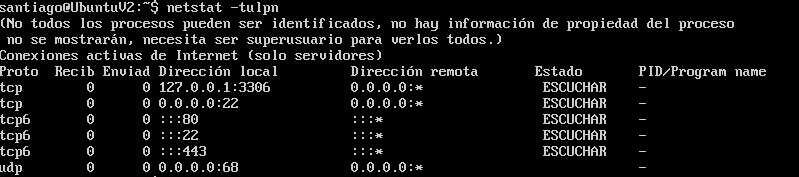

** Practica 4: Asegurar la granja web **
=======================================================

Empezamos arrancando la máquina servidora que vamos a configurar.
Generamos el certificado autofirmado con las ordenes que nos proporciona el guión de prácticas.
Editamos el archivo de configuración /etc/apache2/sites-available/default-ssl y reiniciamos el el servicio apache.

Hacemos curl para comprobar el funcionamiento.

Ahora vamos a configurar el cortafuegos, para lo cual modificamos el archivo /etc/rc.local donde introducimos las reglas del cortafuegos,
para que se realicen al inicio del sistema.

Comprobamos el funcionamiento del cortafuegos ejecutando las ordenes

netstat -tulpn

e iptables -L -n -v

