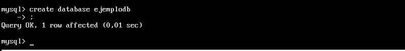
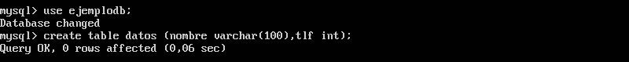
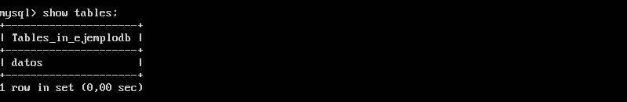
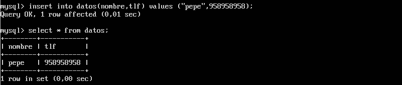
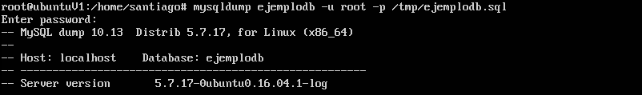
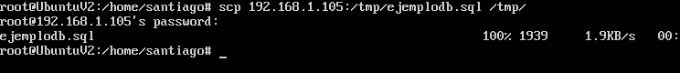
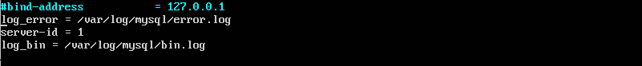
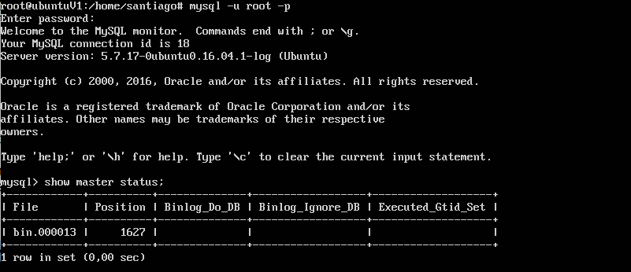
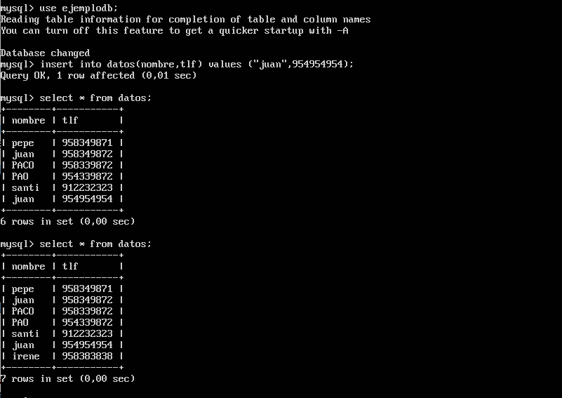
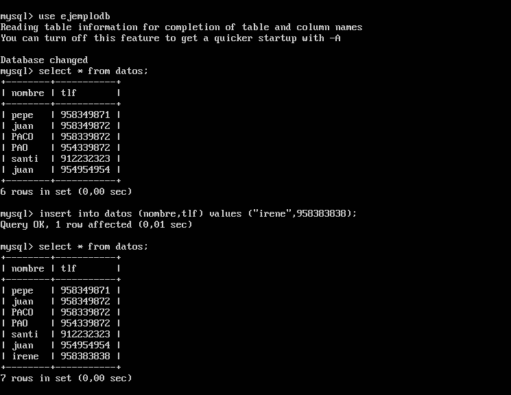

** Practica 5: Replicacion de Bases de datos **
=======================================================

Empezamos arrancando las máquinas que vamos a configurar, tenemos que eliminar o comentar 
el fichero de script que realizamos en la práctica anterior para las iptables.
En este caso vamos a configurar la máquina 1 como servidor y la máquina 2 como réplica.

Entramos en mysql y creamos la base de datos en la máquina.

mysql -u root -p

Usamos la base de datos recien creada y generamos una tabla

y hacemos un insert para que tenga elementos la tabla.

Ahora bloqueamos las tablas como nos indica el guion salimos de mysql y generamos la copia de la base de datos.

Nos vamos a la máquina 2 donde vamos a recibir el fichero que acabamos de crear para copiar la base de datos.

Creamos la base de datos en la máquina 2 como nos indica el guión y volcamos el fichero que acabamos de recibir.

Ahora vamos a configurar los servidores para que las copias se hagan automaticamente.
Abrimos el fichero /etc/mysql/mysql.conf.d/mysqld.cnf en la máquina 1 para la primera configuracion e introducimos
las siguientes lineas.

comentamos la linea #bind-address 127.0.0.1 y buscamos si los ficheros que acabamos de introducir estan ya con otra
ruta.

En la máquina 2 hacemos lo mismo pero sustituyendo server-id = 2 y reiniciamos los servicios de mysql.

Ahora vamos a la máquina 1, entramos en mysql e introducimos las siguientes sentencias.

CREATE USER esclavo IDENTIFIED BY 'esclavo';
GRANT REPLICATION SLAVE ON *.* TO 'esclavo'@'%' IDENTIFIED BY 'esclavo';
FLUSH PRIVILEGES;
FLUSH TABLES;
FLUSH TABLES WITH READ LOCK;

En mi caso al crear la configuracion varias veces el user en vez de ser 'esclavo' el definitivo ha sido 'slave'.

Ahora miramos el status del servidor.

Tenemos que tenerlo en cuenta para configurar la máquina 2.
Con lo cual vamos a la máquina 2 entramos en mysql e introducimos la sentencia critica.

CHANGE MASTER TO MASTER_HOST='192.168.1.105', 
MASTER_USER='slave', 
MASTER_PASSWORD='slave', 
MASTER_LOG_FILE='bin.000013', 
MASTER_LOG_POS=1627, 
MASTER_PORT=3306;

En el esclavo hacemos start slave; y si todo ha ido bien ya esta en funcionamiento, hacemos las comprobaciones que nos indica
el guión mysql> SHOW SLAVE STATUS\G
y en la máquina 1 desbloqueamos las tablas con UNLOCK TABLES;

En mi caso no todo funcionaba como debía por haber copiado las máquinas y tener el mismo uuid con lo cual para cambiarlo,
vamos en la máquina 2 al fichero /var/lib/mysql/auto.cnf y lo borramos.
Al arrancar de nuevo mysql nos lo genera de nuevo con otro uuid.
Una vez hecho esto todo funciona correctamente, asi que ahora vamos a hacer la configuracion Maestro - Maestro.
Para lo cual hacemos los pasos:

En la máquina 2 hasta ahora esclava 

CREATE USER slave2 IDENTIFIED BY 'slave2';
GRANT REPLICATION SLAVE ON *.* TO 'slave2'@'%' IDENTIFIED BY 'slave2';
FLUSH PRIVILEGES;
FLUSH TABLES;
FLUSH TABLES WITH READ LOCK;

y miramos los datos necesarios para configurar en la máquina 1 con la siguiente sentencia.

CHANGE MASTER TO MASTER_HOST='192.168.1.100', 
MASTER_USER='slave2', 
MASTER_PASSWORD='slave2', 
MASTER_LOG_FILE='bin.000003', 
MASTER_LOG_POS=143, 
MASTER_PORT=3306;

Hacemos el start slave;

y ahora comprobamos el funcionamiento.

En esta imagen vemos como hago un insert de juan y en la siguiente imagen se ve

En la siguiente imagen se hace el insert de irene y en la foto anterior solo con hacer un select * from datos se actualiza.

