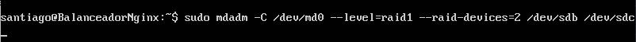
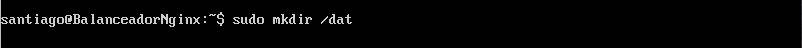
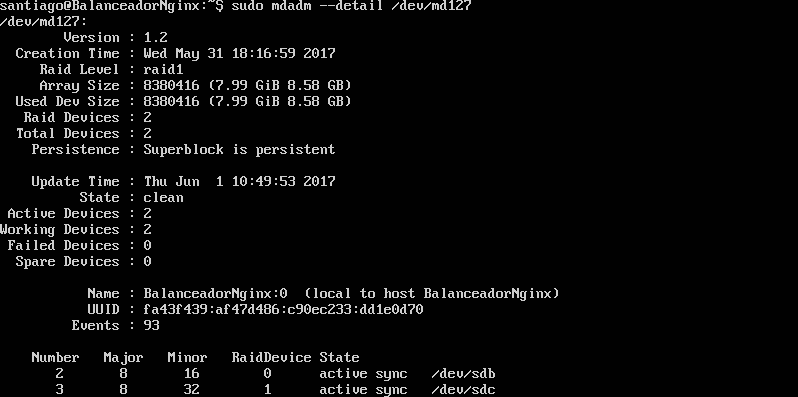
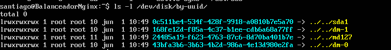
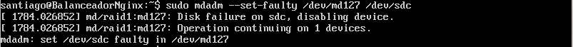
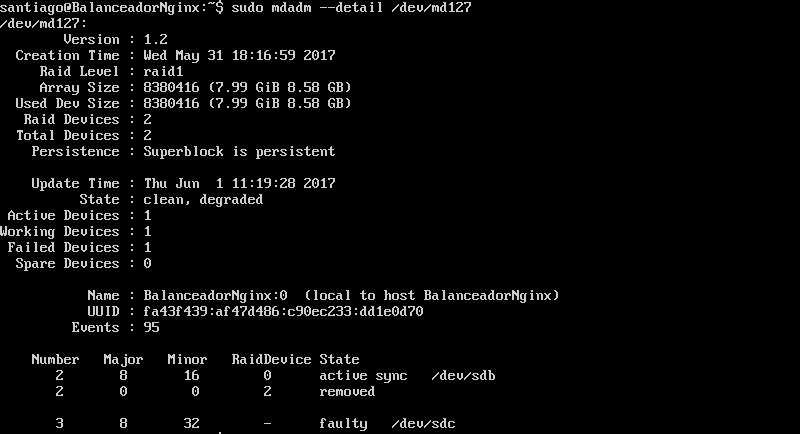
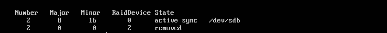
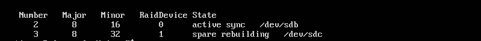
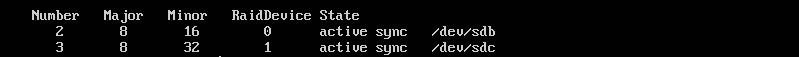

** Practica 6: Discos en RAID **
=======================================================

Empezamos creando 2 discos duros virtuales en la máquina virtual, del mismo tipo que el que tiene instalado el sistema operativo.

Instalamos la aplicación mdadm.

sudo apt-get install mdadm y vemos que la identificacion asignada por ubuntu a los discos es sdb y sdc

Ahora creamos el nivel RAID 1

Le damos formato  al dispositivo RAID

Creamos la carpeta /dat y la montamos en el dispositivo RAID

Comprobamos el estado de RAID, en este caso lo hacemos con md127 porque ya hemos reiniciado.

Ahora comprobamos el uuid del dispositivo con ls -l /dev/disk/by-uuid/

Y editamos el fichero /etc/fstab añadiendo la siguiente linea

Ahora simulamos un fallo en uno de los discos en este caso el sdc

Miramos los detalles

Borramos el disco.

Vemos en los detalles que está eliminado.

Ahora añadimos el disco de nuevo y vemos como se vuelve a sincronizar

